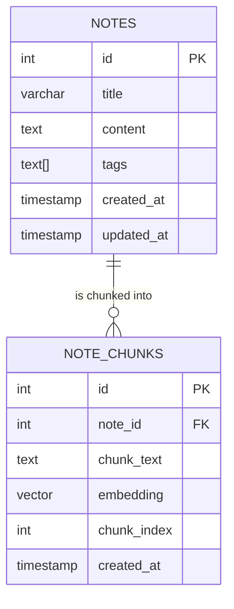

```mermaid
erDiagram
    NOTES {
        int id PK
        varchar title
        text content
        text[] tags
        timestamp created_at
        timestamp updated_at
    }
    
    NOTE_CHUNKS {
        int id PK
        int note_id FK
        text chunk_text
        vector embedding
        int chunk_index
        timestamp created_at
    }
    
    NOTES ||--o{ NOTE_CHUNKS : "is chunked into"
```
