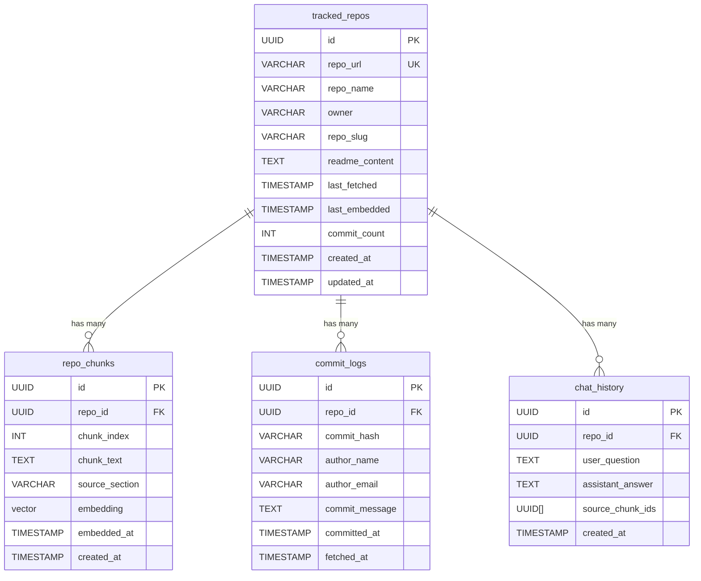

### Table Details

**tracked_repos:**
- Stores metadata about repos being tracked
- `last_fetched`: When README was last pulled
- `last_embedded`: When chunks were last embedded

**repo_chunks:**
- Stores README chunks + their embeddings
- Used for similarity search during RAG

**commit_logs:**
- Stores recent commits fetched by cron
- For displaying repo activity on the frontend
- Unique constraint prevents duplicates

**chat_history:**
- Optional: log of Q&A for the UI
- `source_chunk_ids`: Shows which README parts were used
